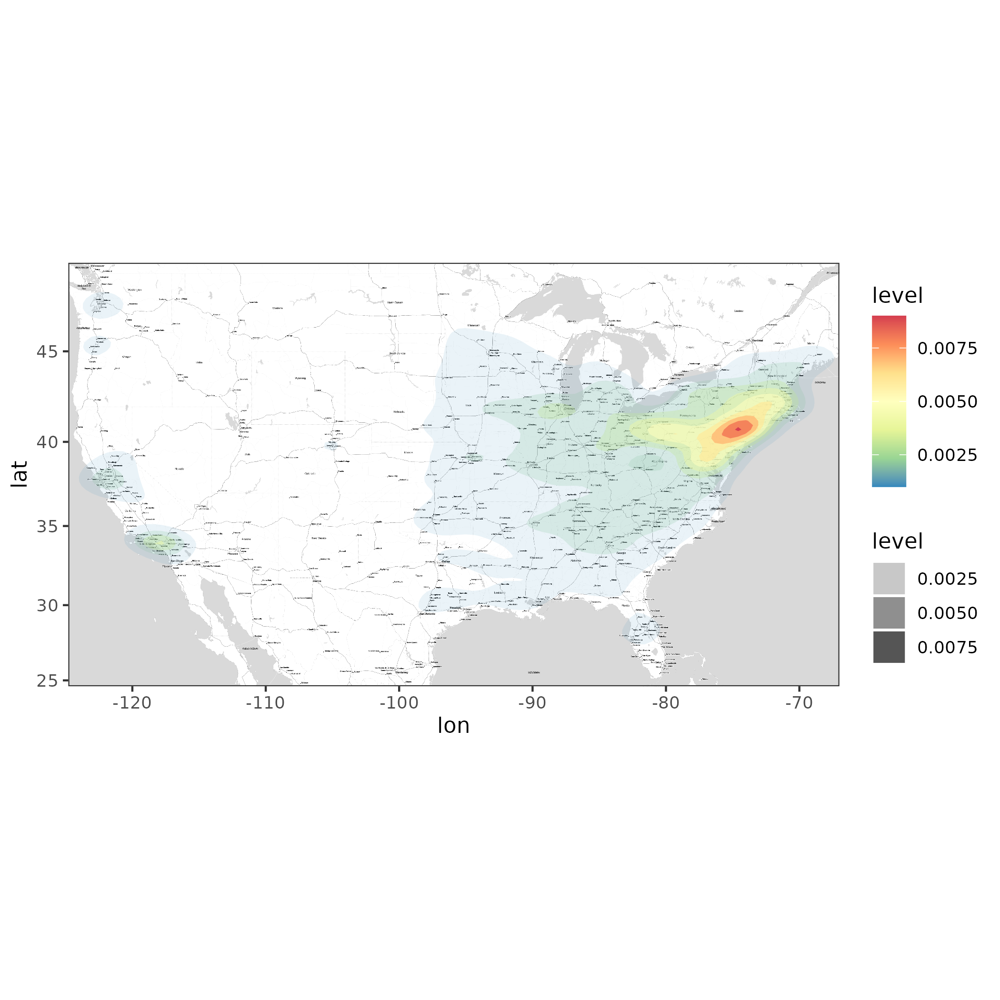

# Project Description
{description of project}

+ Iouzipcodes
```{r, include=FALSE, echo=FALSE}
library(gtools) #used for binomial search of zip code lat/lon
library(dplyr)
library(ggplot2)
```
```{r, echo=FALSE, eval=FALSE}
site <- "iouzipcodes2015.csv"
iouZips <- read.csv(file = site)
head(iouZips, n = 10) # show first five rows

#number of iouZips by state
iouZips %>% 
	group_by(state) %>% 
	summarise(count = n()) %>% 
	ggplot(aes(x = reorder(state,(-count)), y = count)) + 
		geom_bar(stat = 'identity')
```
+ NonIouzipcodes
```{r, echo=FALSE, eval=FALSE}
site <- "noniouzipcodes2015.csv"
nonIouZips <- read.csv(file = site)
head(nonIouZips, n = 1) # show first five rows

#number of noniouZips by state
nonIouZips %>% 
	group_by(state) %>% 
	summarise(count = n()) %>% 
	ggplot(aes(x = reorder(state,(-count)), y = count)) + 
		geom_bar(stat = 'identity')
```

+ ZipCode latitude and longitation
```{r, echo=FALSE, eval=FALSE}
site <- "zipcodelatlon.csv"
zipsLocation <- read.csv(file = site)
head(zipsLocation, n = 5) # show first five rows

#These two functions allow you to search a zipcodes Latitude, first is a helper function
subFun <- function(x) {
  return (zipsLocation$ZIP[[x]])
}
findLat <- function(zip)
{
  i <- zipsLocation$Latitude[[binsearch(fun = subFun, range = c(1,nrow(zipsLocation)), target = zip)$where[1]]]
  return (i)
} 
findLon <- function(zip)
{
  i <- zipsLocation$Longitude[[binsearch(fun = subFun, range = c(1,nrow(zipsLocation)), target = zip)$where[1]]]
  return (i)
} 

#First iouZips
iouZipsLoc <- 
  mutate(iouZips, lat = -1, lon = -1)
#nrow(iouZipsLoc)
for (i in 1:52614)
{
  iouZipsLoc$lat[[i]] <- findLat(iouZipsLoc$zip[[i]])
  iouZipsLoc$lon[[i]] <- findLon(iouZipsLoc$zip[[i]])
}
#Then nonIouZips
nonIouZipsLoc <- 
  mutate(nonIouZips, lat = -1, lon = -1)
nrow(nonIouZips)
for (i in 1:34014)
{
  nonIouZipsLoc$lat[[i]] <- findLat(nonIouZipsLoc$zip[[i]])
  nonIouZipsLoc$lon[[i]] <- findLon(nonIouZipsLoc$zip[[i]])
}

head(iouZipsLoc, 2)
head(nonIouZipsLoc, 2)

allZipsLoc <- rbind(iouZipsLoc, nonIouZipsLoc)


write.csv(allZipsLoc, "./zipData.csv", row.names = FALSE)
#TODO: Get a hypothesis for our data before we get too far
```

+ Mapping state elevation to our dataset (Final Processing)
```{r,echo=FALSE,eval=FALSE}
elev <- read.csv(file = "./state_elev.csv")
allZipsLoc <- read.csv(file = "zipData.csv")
elev
allZipsLoc <- mutate(allZipsLoc, elevation = -1)

findAbbrevIndex <- function(x) {
  for (i in 1:51) {
    if (elev$Abbreviation[[i]] == x)
      return(i)
  }
  return (-1)
}

allZipsLoc$elevation[[1]] <- elev$mean_elev[findAbbrevIndex(allZipsLoc$state[1])]
head(allZipsLoc)
elev$mean_elev[findAbbrevIndex(elev$state[1])]
for (i in 1:86628)
{
  allZipsLoc$elevation[[i]] <- elev$mean_elev[findAbbrevIndex(allZipsLoc$state[i])]
}
head(allZipsLoc)
write.csv(allZipsLoc, "./masterDataSet.csv")

```


Coordinate Heatmap
```{r, echo=FALSE, eval=FALSE}
# References: 
# https://axelhodler.medium.com/creating-a-heat-map-from-coordinates-using-r-780db4901075
# https://github.com/axelhodler/heator/blob/master/README.md
# http://maps.stamen.com/#terrain/12/37.7706/-122.3782

library(ggmap)
library(RColorBrewer)

# Make table of just coordinates
coords.data <- read.csv(file="./zipData.csv")
coords.data <- subset(coords.data, select=c(lat,lon))
names(coords.data)[names(coords.data) == 'lon'] <- 'Longitude'
names(coords.data)[names(coords.data) == 'lat'] <- 'Latitude'

# Define bounds of USA
map_bounds <- c(left = -124.8, bottom = 24.6, right = -67, top = 49.5)

# Configure map, bounds, zoom, & style
coords.map <- get_stamenmap(map_bounds, zoom=7, maptype="toner-lite")

# Logic for rendering heatmap
coords.map <- ggmap(coords.map, extent="device", legend="none")
coords.map <- coords.map + stat_density2d(data=coords.data,  aes(x=Longitude, y=Latitude, fill=..level.., alpha=..level..), geom="polygon")
coords.map <- coords.map +   scale_fill_gradientn(colours=rev(brewer.pal(7, "Spectral")))

# Output map
coords.map <- coords.map + theme_bw()
ggsave(filename="./heat.png")
```



Plotting Rates
```{r}
allZipsLoc <- read.csv(file = "zipData.csv")
# Rate histograms

# Commercial
ggplot(allZipsLoc, aes(x=comm_rate)) +
  geom_histogram(bins=150, fill="#1A4645") +
  geom_vline(aes(xintercept=mean(res_rate)),
            color="orange", linetype="dashed", size=1) +
  xlim(.001,.38)

# Industrial
ggplot(allZipsLoc, aes(x=ind_rate)) +
  geom_histogram(bins=150, fill="#1A4645") +
  geom_vline(aes(xintercept=mean(ind_rate)),
            color="orange", linetype="dashed", size=1) +
  xlim(.001,.4)

# Residential
ggplot(allZipsLoc, aes(x=res_rate)) +
  geom_histogram(bins=150, fill="#1A4645") +
  geom_vline(aes(xintercept=mean(res_rate)),
            color="orange", linetype="dashed", size=1) +
  xlim(.001,.38)
```

Second ggplot section
```{r, echo=FALSE, eval=FALSE}
allZipsLoc <- read.csv(file = "masterDataSet.csv")


allZipsLoc %>%
  filter(service_type == "Energy") %>%
  count()

ggplot(data = allZipsLoc, aes(x = elevation, y = res_rate)) +
  geom_jitter(alpha = 0.05) + geom_smooth(method = "lm", se = FALSE) + ylim(0,0.3) +
  labs(title = "Residential Electricity Rates over State Mean Elevation",
       y = "Residential Electricity Rates in $",
       x = "Mean Elevation of the State")


model_base <- lm(data = allZipsLoc, res_rate ~ elevation)
summary(model)

model_factor <- lm(data = allZipsLoc, res_rate ~ elevation + service_type)
summary(model_factor)

residential <- allZipsLoc %>%
  mutate(rates = res_rate, indu = FALSE)

industrial <- allZipsLoc %>%
  mutate(rates = ind_rate, indu = TRUE)

resVsIndustry <- rbind(residential,industrial)

boot_dist <- resVsIndustry %>%
  # Specify the response and success
  specify(response = rates, explanatory = indu) %>%
  # Generate 500 bootstrap reps
  generate(reps = 500, type = "bootstrap") %>%
  # Calculate proportions
  calculate(stat = "diff in means")

boot_dist

SE <- boot_dist %>%
  summarize(se = sd(stat)) %>%
  pull()

p_hat <- boot_dist %>%
  summarize(ph = mean(stat)) %>%
  pull()

c(p_hat - 2*SE, p_hat + 2*SE)

```

Boxplots by ownership
```{r}
# ------------------------------------

# Commercial
ggplot(allZipsLoc, aes(x=ownership, y=comm_rate)) +
  geom_boxplot()

# Industrial
ggplot(allZipsLoc, aes(x=ownership, y=ind_rate)) +
  geom_boxplot()

# Residential
ggplot(allZipsLoc, aes(x=ownership, y=res_rate)) +
  geom_boxplot()

# -------------------------------------

library(ggthemes)

# Grouped bar plot by ownership
comm_rate_list <- allZipsLoc %>%
  group_by(ownership) %>%
  summarise_at(vars(comm_rate), list(name = mean))

ind_rate_list <- allZipsLoc %>%
  group_by(ownership) %>%
  summarise_at(vars(ind_rate), list(name = mean))

res_rate_list <- allZipsLoc %>%
  group_by(ownership) %>%
  summarise_at(vars(res_rate), list(name = mean))

# Build vector of above values, alternating
vals <- c(0,0,0,0,0,0,0,0,0,0,0,0,0,0,0,0,0,0,0,0,0)
count<-1
for(i in seq(1, 19, 3))
{
  vals[[i]] <- comm_rate_list$name[[count]]
  vals[[i+1]] <- ind_rate_list$name[[count]]
  vals[[i+2]] <- res_rate_list$name[[count]]
  count<-count+1
}

box_df <- data.frame(x = vals, 
                   grp = rep(c("inv owned", "coop", "federal",
                               "municipal","pol sub", "ret pow mark",
                               "state"),
                               each = 3),
                   subgroup = rep(c("commercial", "industrial",
                                    "residential")))

# Create grouped barplot using ggplot2
ggplot(box_df,aes(x = grp, y = x, fill = subgroup)) +
geom_bar(stat = "identity", position = "dodge")
```

Hypothesis Testing
```{r}
library(tidyverse)
library(infer)
# Hypothesis: Utility prices increase at higher elevations

```

Mapping avg residential utility prices by state
```{r}
library(usmap)

res_rate_states <- allZipsLoc %>%
  group_by(state) %>%
  summarise_at(vars(res_rate), list(name = mean))

plot_usmap(data = res_rate_states, values = "name", color = "orange") + 
  scale_fill_continuous(name = "Mean Residential Utility Prices (2019)",
                        low = "white", high = "#1A4645", 
                        label = scales::comma) + 
  theme(legend.position = "right")
```

mapping average elevation
```{r}
# res_rate_states <- allZipsLoc %>%
#  group_by(state) %>%
#  summarise_at(vars(res_rate), list(name = mean))

state_elev <- read.csv(file="state_elev.csv")
state_elev

plot_usmap(data = state_elev, values = "mean_elev", color = "orange") + 
  scale_fill_continuous(name = "Mean Elevation",
                        low = "white", high = "#1A4645", 
                        label = scales::comma) + 
  theme(legend.position = "right")
```
